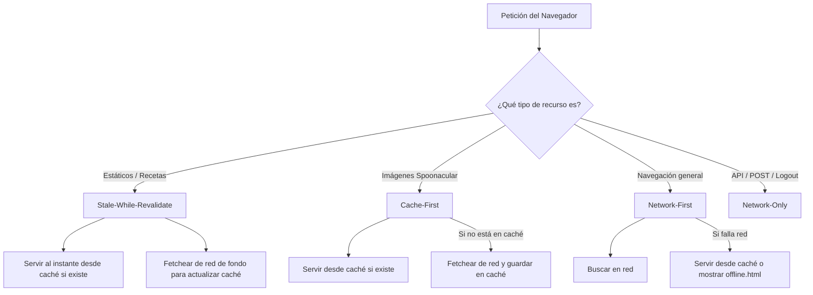

# Guía Explicativa: Service Worker y Modo Offline en What2Cook

Esta guía explica de forma clara y "bajada a tierra" cómo funciona el sistema de Service Worker y cacheo offline implementado en la aplicación, estructurada para ser utilizada como material de apoyo en una presentación oral.

---

## 1. ¿Qué es un Service Worker? (La analogía del "Intermediario")

Imaginá al **Service Worker (SW)** como un **intermediario o mozo** que se para entre tu navegador (el cliente) y el servidor de la aplicación (o APIs externas en internet).

* **Cuando estás online:** Cada vez que el navegador pide una receta o un archivo de estilos, el SW intercepta esa petición. Le pide el archivo al servidor y, al mismo tiempo, se guarda una copia en la heladera (el almacenamiento de caché).
* **Cuando estás offline:** Si no hay internet y hacés una petición, el SW la intercepta, se da cuenta de que la red falló, va a la heladera (caché) y te sirve la copia guardada. El navegador ni se entera de que no hubo conexión; la página se muestra igual.

---

## 2. Nuestra Arquitectura de Cachés

Para no mezclar las cosas y optimizar el rendimiento, dividimos la "heladera" en 3 cajones (o cachés versionadas):

1. **`static-v1` (App Shell / Estáticos):** Guarda los estilos (CSS), la lógica (JS) y la propia página de error/offline (`offline.html`).
2. **`recipes-v1` (Páginas de Receta):** Guarda los archivos HTML completos de cada receta individual que marcaste como favorita (`/receta/{id}`).
3. **`images-v1` (Imágenes externas):** Almacena las imágenes de las recetas servidas por Spoonacular (`img.spoonacular.com`).

---

## 3. Estrategias de Interceptación (¿Cómo decidimos qué cachear?)

No todos los recursos se manejan igual. Usamos tres estrategias fundamentales dependiendo del tipo de recurso:



### A. Stale-While-Revalidate (Usado en assets y recetas)
* **Cómo funciona:** Si el recurso ya está en la caché, lo muestra **inmediatamente** para que la carga sea instantánea. En paralelo, va a la red en segundo plano para ver si hay una versión nueva y actualizar la caché para la próxima visita.
* **Ventaja:** Velocidad extrema percibida por el usuario y actualización silenciosa.

### B. Cache-First (Usado en imágenes externas de Spoonacular)
* **Cómo funciona:** La imagen de una receta casi nunca cambia. Si la imagen está en la caché, se sirve desde ahí directamente sin tocar la red. Si no está, la descarga, la guarda y la muestra.
* **Tope de control (LRU):** Para evitar llenar el disco del usuario con imágenes infinitas, aplicamos un límite manual de **máximo 60 imágenes**. Cuando entra la 61, el SW borra automáticamente la más vieja.

### C. Network-First (Navegación general)
* **Cómo funciona:** Si navegás a una ruta común (como el home o el buscador), el SW intenta ir primero a internet. Si falla la conexión, recién ahí muestra la página especial de offline (`offline.html`).

---

## 4. El Índice JSON Desacoplado: `/offline-favorites.json`

### El Problema del Acoplamiento
Típicamente, para mostrar la lista de recetas offline en la página de fallback, se solía abrir la caché de recetas y parsear el código HTML (buscar las etiquetas `<h1>` y las imágenes ``) con expresiones regulares para armar la grilla. Esto es frágil: si el programador cambia una clase CSS o la estructura en el backend, la grilla offline se rompe en producción sin que nadie lo note online.

### Nuestra Solución (Índice Sintético)
El SW crea y mantiene un archivo JSON virtual en caché llamado `/offline-favorites.json` con la estructura:
```json
[
  { "spoonacular_id": 123, "title": "Milanesa con puré", "image": "https://..." }
]
```
Cuando el usuario está offline y carga la página especial, `offline.html` hace un `fetch` a este archivo JSON local y renderiza las tarjetas de forma dinámica, limpia y completamente desacoplada del HTML de las recetas.

---

## 5. Sincronización en Tiempo Real: El Mensajero (`postMessage`)

¿Cómo se entera el Service Worker de que el usuario interactuó con la interfaz?

1. **Al agregar/quitar favoritos en caliente:**
   Cuando tocás el botón de "corazón" en la interfaz, `favorites.js` ejecuta la petición a la base de datos local (POST `/api/favorites`). Si es exitosa, le envía un mensaje al SW (`postMessage`) diciendo: *"Che, agregá esta receta a favoritos, descargá su HTML y su imagen"* o *"Quitala de la caché porque ya no es favorita"*.
2. **Reconciliación al cargar (Garantía de consistencia):**
   Si el usuario inicia sesión o cambia de dispositivo, sus favoritos pueden haber cambiado. Al cargar la aplicación (vía `sw-register.js`), si el navegador detecta que hay red, consulta al endpoint `/api/favorites` para obtener la lista real. Luego, le manda la lista completa al SW (`RECONCILE`), y este se encarga de descargar las recetas que falten y borrar las que ya no correspondan.

---

## 6. Privacidad y Seguridad: La Purga de Logout

Si un usuario cierra sesión, por privacidad **no queremos** que otro usuario que use la misma computadora pueda entrar y ver sus recetas favoritas offline.

* **Cómo lo resolvimos:** El Service Worker intercepta la petición `POST /logout` de la aplicación.
* **El truco de bloqueo:** Para evitar carreras (donde el navegador se desloguea y te redirige al home tan rápido que el SW no llega a borrar la caché), el SW intercepta el evento de logout y **bloquea la respuesta redirigida** utilizando promesas (`respondWith`). Primero elimina las cachés `recipes-v1` y `images-v1`, resetea el índice JSON a un array vacío `[]` y, recién cuando todo está borrado, le devuelve al navegador la orden de redirección.

---

## Puntos Clave para Destacar en una Presentación Oral:
1. **Desacoplamiento:** Explicar el beneficio de usar `/offline-favorites.json` en lugar de parsear HTML para evitar romper la grilla offline con cambios estéticos.
2. **Control de Almacenamiento (LRU):** Mostrar que somos responsables con el almacenamiento móvil limitando la caché de imágenes a 60 elementos.
3. **Seguridad / Privacidad:** Explicar la importancia de la interceptación del logout para purgar datos sensibles de usuario inmediatamente de la caché.
4. **Optimización con ignoreSearch:** El proyecto tiene un cache-busting dinámico (`?v=timestamp`). Si no configurábamos `ignoreSearch: true` en el Service Worker, las peticiones nunca coincidirían con la caché y el offline no funcionaría.
